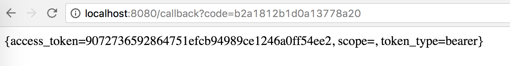

= Implement the Callback

Reference https://developer.github.com/v3/oauth/#2-github-redirects-back-to-your-site

Now we need to convert the `code` that we received into an `access_token`

1. Add a controller to response to the callback request
+
[source,java]
----

RestTemplate restTemplate = new RestTemplate();

@GetMapping("/callback")
@ResponseBody
Object callback(@RequestParam String code) {

  HashMap response = restTemplate.postForEntity("https://github.com/login/oauth/access_token?" +
      "client_id=13e67f9acf45a46a6567&" +
      "client_secret=dc51ddd68a03ff435a497b3023b44a37b55fbc1d&" +
      "code=" + code, null, HashMap.class).getBody();

  return response.toString();
}
----
1. Go to http://localhost:8080/ and click `Login with Github` button again
+

1. Extract `access_token` in a type safe manner, add a token class
+
[source,java]
----
class GithubTokenResponse {

  private final String accessToken;

  @JsonCreator
  public GithubTokenResponse(
    @JsonProperty("access_token") String accessToken) {
    this.accessToken = accessToken;
  }

  public String getAccessToken() {
    return accessToken;
  }

  @Override
  public String toString() {
    return "GithubTokenResponse{" +
        "accessToken='" + accessToken + '\'' +
        '}';
  }
}
----

1. Change callback controller
+
[source,java]
----
@GetMapping("/callback")
@ResponseBody
Object callback(@RequestParam String code) {

  GithubTokenResponse response = restTemplate.postForEntity("https://github.com/login/oauth/access_token?" +
      "client_id=13e67f9acf45a46a6567&" +
      "client_secret=dc51ddd68a03ff435a497b3023b44a37b55fbc1d&" +
      "code=" + code, null, GithubTokenResponse.class).getBody();

  return response;
}
----

1. *[Optional]* Register your own oauth2 app https://github.com/settings/applications/new
  - upon successful registration you will get your own `client_id` and `client_secret`, change the above
  code to use your own app's info

1. *[Optional]* Hard coding is never a good idea, let's externalize that

1. edit `application.properties`
+
[source,properties]
----
github.clientId=13e67f9acf45a46a6567
github.clientSecret=dc51ddd68a03ff435a497b3023b44a37b55fbc1d
github.accessTokenUri=https://github.com/login/oauth/access_token?code={code}&client_id=${github.clientId}&client_secret=${github.clientSecret}
github.userUri=https://api.github.com/user?access_token={token}
github.authoriseUri=https://github.com/login/oauth/authorize?client_id=${github.clientId}
----

1. add new class `GithubConfig`
+
[source,java]
----
@ConfigurationProperties(prefix = "github")
class GithubConfig {

    private UriTemplate accessTokenUri;
    private UriTemplate userUri;
    private String authoriseUri;

    public URI getUserUri(String accessToken) {
        return userUri.expand(accessToken);
    }

    public void setUserUri(String userUri) {
        this.userUri = new UriTemplate(userUri);
    }

    public URI getAccessTokenUri(String code) {
        return accessTokenUri.expand(code);
    }

    public void setAccessTokenUri(String accessTokenUri) {
        this.accessTokenUri = new UriTemplate(accessTokenUri);
    }

    public String getAuthoriseUri() {
        return authoriseUri;
    }

    public void setAuthoriseUri(String authoriseUri) {
        this.authoriseUri = authoriseUri;
    }
}
----

1. add `@EnableConfigurationProperties(GithubConfig.class)` to `SpringularApplication`

1. edit handlers
+
[source,java]
----

@GetMapping("/githubLogin")
String githubLogin() {
    return "redirect:" + githubConfig.getAuthoriseUri();
}

@Autowired
GithubConfig githubConfig;

@GetMapping("/callback")
Object callback(@RequestParam String code) {

    GithubTokenResponse response = restTemplate.postForEntity(
      githubConfig.getAccessTokenUri(code),
      null, GithubTokenResponse.class).getBody();

    GithubUser githubUser = restTemplate.getForObject(
      githubConfig.getUserUri(response.getAccessToken()),
      GithubUser.class);

    // only change the above 2 calls
    // ...
    // rest of the codes should left unchanged
}
----
