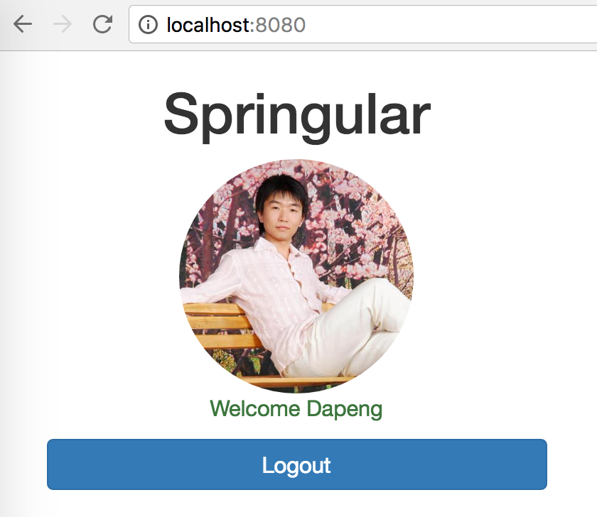
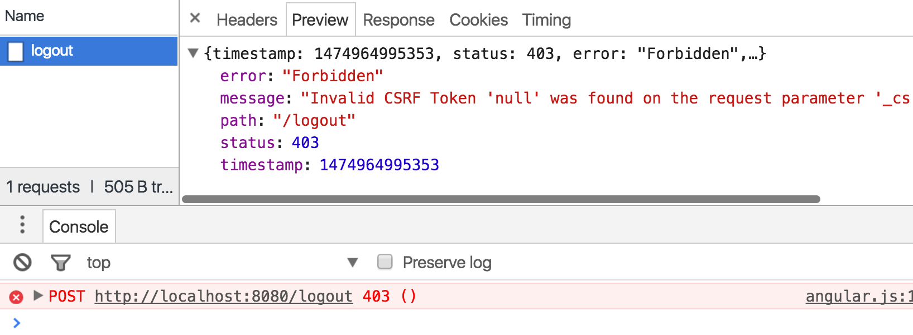

= Finish up with the UI

Now let's implement the UI when the user is successfully logged in

1. edit `index.html`, change the `authenticated` div tag
+
[source,html]
----

    

    

        Welcome 
    

    

        <button ng-click="home.logout()" class="btn btn-primary btn-block">Logout</button>
    

----

1. implement the logout button
+
[source,javascript]
----
angular.module("app", []).controller("home", function ($http, $location) {
    var self = this;

    $http.get("/me").success(function (data) {
        self.user = data.details;
        self.authenticated = true;
    }).error(function () {
        self.user = "";
        self.authenticated = false;
    });

// add following
    self.logout = function () {
        $http.post('/logout', {}).success(function () {
            self.authenticated = false;
            $location.path("/");
        }).error(function (data) {
            self.authenticated = false;
        });
    };

});
----

1. remember to reload the app
+

1. What happens when you click the `Logout` button? make sure you turn on your
browser's inspector
+

1. Let's go to fix that, add csrf config into the WebSecurityConfigurerAdapter
+
[source,java]
----
http
    // ignore many lines for brevity
    // add this line
    .and().csrf().csrfTokenRepository(CookieCsrfTokenRepository.withHttpOnlyFalse());
----

1. Now reload your app to see the logout button working

1. *[optional]* Experiment
  - logout from springular
  - Go to https://github.com/settings/applications to revoke the access
  - access http://localhost:8080/ and `Login with Github`
  - Now you can see you back to the page where github asks your consent 
