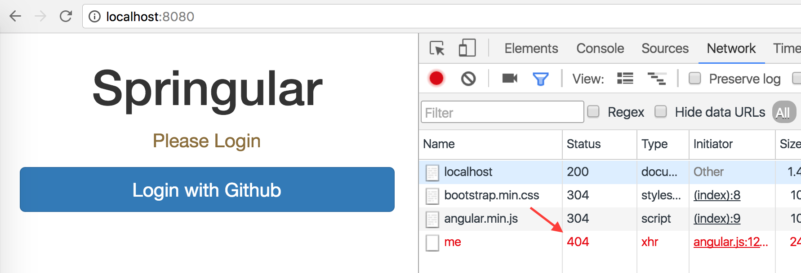

= Project Setup

1. Go to https://start.spring.io to generate your project skeleton

- group: singasug
- artifact: springular
- dependencies: web, devtools
+
image::setup.png[]

1. Click "Generate Project" button to download the project zip
1. Unzip and open the project in your favorite IDE
1. Add angular and bootstrap dependency to `pom.xml`
+
[source,xml]
----
<dependency>
    <groupId>org.webjars</groupId>
    <artifactId>bootstrap</artifactId>
    <version>3.3.7</version>
</dependency>

<dependency>
    <groupId>org.webjars</groupId>
    <artifactId>angularjs</artifactId>
    <version>1.5.8</version>
</dependency>
----
1. Let's create a simple angular UI `src/main/resources/static/index.html`
+
[source,html]
----
<!DOCTYPE html>
<html lang="en">
<head>
    <meta charset="UTF-8">
    <meta name="viewport" content="width=device-width, initial-scale=1, user-scalable=0, minimal-ui">
    <title>Springular</title>

    <link rel="stylesheet" href="/webjars/bootstrap/3.3.7/css/bootstrap.min.css"/>
    
    

</head>

<body ng-app="app" ng-controller="home as home">

    <h1>Springular</h1>

    

        
Please Login

        <a class="btn btn-block btn-primary" href="/githubLogin">Login with Github</a>
    

    

        not implemented yet
    

</body>
</html>
----
+
So basically, we will use ajax to call the url `/me`, if there is an error
(which is indeed the case now since we haven't implemented any controller yet),
we will simply display a `Please Login` message
1. Now run the project and hit the url http://localhost:8080 Don't worry about the 404 error yet
+

