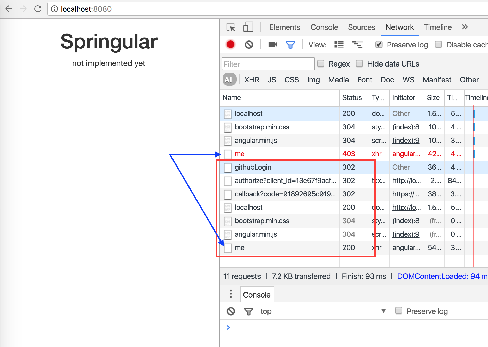

= User Spring Security to Protect the App

Now we are ready to lock the application down with spring security

1. add `pom.xml` dependency
+
[source,xml]
----
<dependency>
  <groupId>org.springframework.boot</groupId>
  <artifactId>spring-boot-starter-security</artifactId>
</dependency>
----

2. add security configuration
+
[source,java]
----
@Bean
WebSecurityConfigurerAdapter webSecurityConfigurerAdapter() throws Exception {
    return new WebSecurityConfigurerAdapter() {
        @Override
        protected void configure(HttpSecurity http) throws Exception {
            http
                    .httpBasic().disable() // since we are using oauth

                    .authorizeRequests()
                    .mvcMatchers("/me").authenticated()
                    .mvcMatchers("/callback").permitAll()

                    .and().logout().logoutSuccessHandler((req, resp, auth) -> {}).permitAll();
        }
    };
}
----

1. Change the callback handler
+
[source,java]
----
@GetMapping("/callback")
// @ResponseBody //<-- comment out this
Object callback(@RequestParam String code) {

	GithubTokenResponse response = restTemplate.postForEntity("https://github.com/login/oauth/access_token?" +
			"client_id=13e67f9acf45a46a6567&" +
			"client_secret=dc51ddd68a03ff435a497b3023b44a37b55fbc1d&" +
			"code=" + code, null, GithubTokenResponse.class).getBody();

	GithubUser githubUser = restTemplate.getForObject(
			"https://api.github.com/user?access_token=" + response.getAccessToken(),
			GithubUser.class);

	// add following
	SecurityContextHolder.getContext().setAuthentication(new AbstractAuthenticationToken(Collections.emptyList()) {

		{
			setAuthenticated(true);
			setDetails(githubUser);
		}

		@Override
		public Object getCredentials() { return null; }

		@Override
		public Object getPrincipal() { return githubUser.getUsername(); }

	});

	return "redirect:/"; // <- change to this
}
----

1. add the `/me` handler
+
[source,java]
----
@GetMapping("/me")
@ResponseBody
Object me(Principal principal) {
    return principal;
}
----

1. Restart your app, and `Login with Github`. Before doing that you may want to
open up your browser's inspector
+

1. *[Optional]* Inspect the http requests
