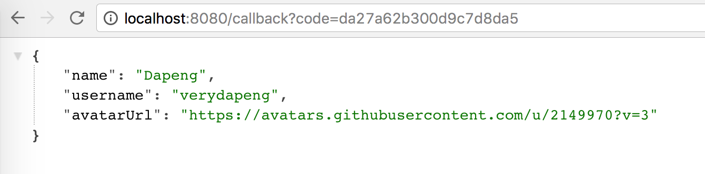

= Get to know the user

Since we had the `access_token`, now we can access the user's public profile

reference https://developer.github.com/v3/oauth/#3-use-the-access-token-to-access-the-api

1. Use the `access_token` from the prev step to access user's info
https://api.github.com/user?access_token=PUT_YOUR_TOKEN_HERE
+
[source,json]
----
{
  "login": "verydapeng",
  "id": 2149970,
  "avatar_url": "https://avatars.githubusercontent.com/u/2149970?v=3",
  "gravatar_id": "",
  "url": "https://api.github.com/users/verydapeng",
  "html_url": "https://github.com/verydapeng",
  "followers_url": "https://api.github.com/users/verydapeng/followers",
  "following_url": "https://api.github.com/users/verydapeng/following{/other_user}",
  "gists_url": "https://api.github.com/users/verydapeng/gists{/gist_id}",
  "starred_url": "https://api.github.com/users/verydapeng/starred{/owner}{/repo}",
  "subscriptions_url": "https://api.github.com/users/verydapeng/subscriptions",
  "organizations_url": "https://api.github.com/users/verydapeng/orgs",
  "repos_url": "https://api.github.com/users/verydapeng/repos",
  "events_url": "https://api.github.com/users/verydapeng/events{/privacy}",
  "received_events_url": "https://api.github.com/users/verydapeng/received_events",
  "type": "User",
  "site_admin": false,
  "name": "Dapeng",
  "company": "Pivotal",
  "blog": "https://verydapeng.com",
  "location": "Singapore",
  "email": "mail@verydapeng.com",
  "hireable": null,
  "bio": null,
  "public_repos": 20,
  "public_gists": 5,
  "followers": 11,
  "following": 19,
  "created_at": "2012-08-14T09:54:54Z",
  "updated_at": "2016-09-22T08:17:00Z"
}
----
1. Let's model the user, for the sake a brevity, we are only
covering the `name`, `username` and `avatar_url` fields here
+
[source,java]
----
class GithubUser {

	private String username;
	private String name;
	private String avatarUrl;

	@JsonCreator
	public GithubUser(@JsonProperty("login") String username,
					  @JsonProperty("name") String name,
					  @JsonProperty("avatar_url") String avatarUrl) {
		this.username = username;
		this.name = name;
		this.avatarUrl = avatarUrl;
	}

	public String getAvatarUrl() {
		return avatarUrl;
	}

	public String getUsername() {
		return username;
	}

	public String getName() {
		return name;
	}

	@Override
	public String toString() {
		return "GithubUser{" +
				"username='" + username + '\'' +
				", name='" + name + '\'' +
				'}';
	}
}
----

1. Get the user's info, modify our callback handler again
+
[source,java]
----
@GetMapping("/callback")
@ResponseBody
Object callback(@RequestParam String code) {

  GithubTokenResponse response = restTemplate.postForEntity("https://github.com/login/oauth/access_token?" +
      "client_id=13e67f9acf45a46a6567&" +
      "client_secret=dc51ddd68a03ff435a497b3023b44a37b55fbc1d&" +
      "code=" + code, null, GithubTokenResponse.class).getBody();

  GithubUser githubUser = restTemplate.getForObject(
      "https://api.github.com/user?access_token=" + response.getAccessToken(),
      GithubUser.class);

  return githubUser;
}
----

1. Now we go back to http://localhost:8080/ and `Login with Github` again,
expecting to see something like
+

== Optional ==
1. Hard coding is never a good idea, let's externalize the configurations

1. edit `application.properties`
+
[source,properties]
----
github.clientId=13e67f9acf45a46a6567
github.clientSecret=dc51ddd68a03ff435a497b3023b44a37b55fbc1d
github.accessTokenUri=https://github.com/login/oauth/access_token?code={code}&client_id=${github.clientId}&client_secret=${github.clientSecret}
github.userUri=https://api.github.com/user?access_token={token}
github.authoriseUri=https://github.com/login/oauth/authorize?client_id=${github.clientId}
----

1. add new class `GithubConfig` to read the config values
+
[source,java]
----
@ConfigurationProperties(prefix = "github")
class GithubConfig {

    private UriTemplate accessTokenUri;
    private UriTemplate userUri;
    private String authoriseUri;

    public URI getUserUri(String accessToken) {
        return userUri.expand(accessToken);
    }

    public void setUserUri(String userUri) {
        this.userUri = new UriTemplate(userUri);
    }

    public URI getAccessTokenUri(String code) {
        return accessTokenUri.expand(code);
    }

    public void setAccessTokenUri(String accessTokenUri) {
        this.accessTokenUri = new UriTemplate(accessTokenUri);
    }

    public String getAuthoriseUri() {
        return authoriseUri;
    }

    public void setAuthoriseUri(String authoriseUri) {
        this.authoriseUri = authoriseUri;
    }
}
----

1. add `@EnableConfigurationProperties(GithubConfig.class)` to `SpringularApplication`
+
[source,java]
----
@SpringBootApplication
@EnableConfigurationProperties(GithubConfig.class) // <- add this
@Controller
public class SpringularApplication {
}
----

1. edit the handlers to make use of the GithubConfig object
+
[source,java]
----

@Autowired
GithubConfig githubConfig;

@GetMapping("/githubLogin")
String githubLogin() {
    return "redirect:" + githubConfig.getAuthoriseUri();
}

@GetMapping("/callback")
Object callback(@RequestParam String code) {

    GithubTokenResponse response = restTemplate.postForEntity(
      githubConfig.getAccessTokenUri(code),
      null, GithubTokenResponse.class).getBody();

    GithubUser githubUser = restTemplate.getForObject(
      githubConfig.getUserUri(response.getAccessToken()),
      GithubUser.class);

    // only change the above 2 calls
    // ...
    // rest of the codes should left unchanged
}
----
